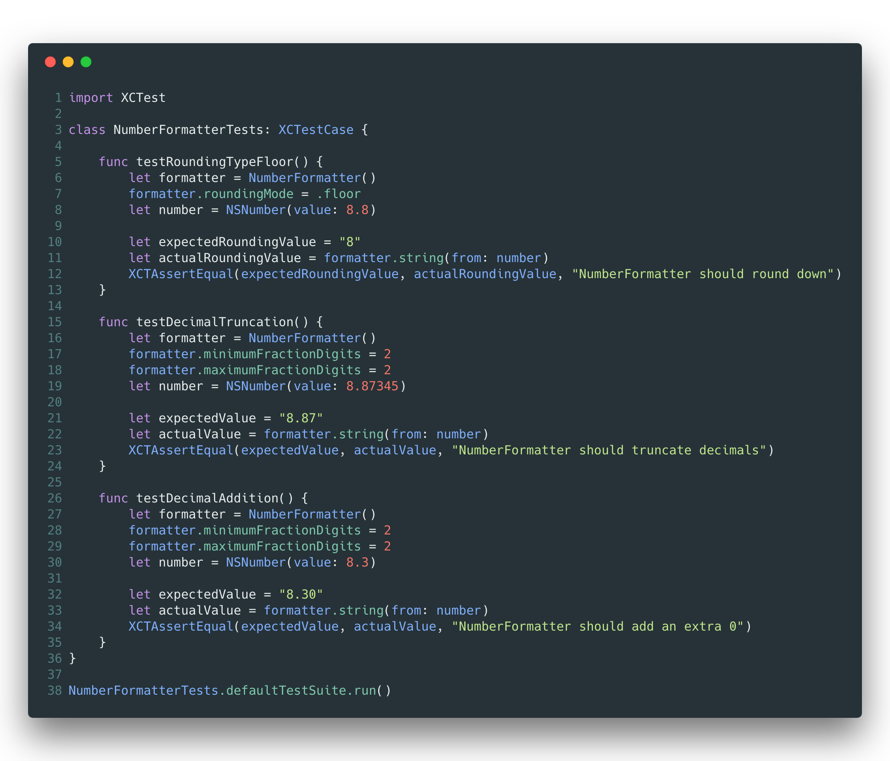
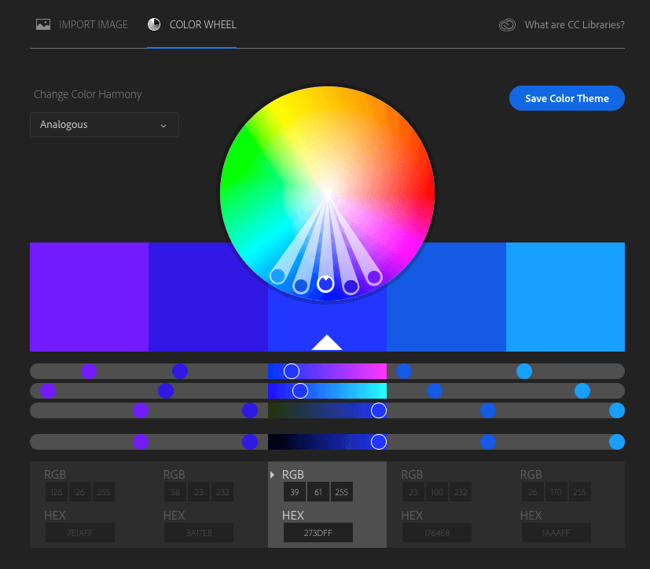
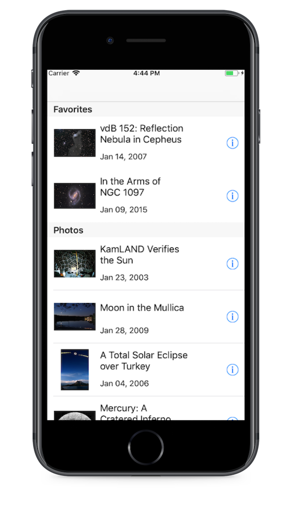
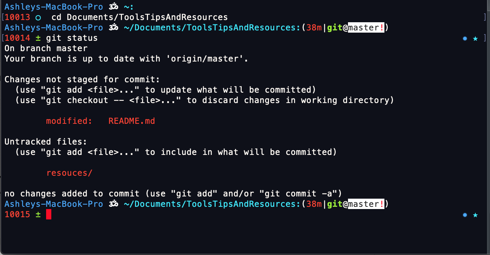
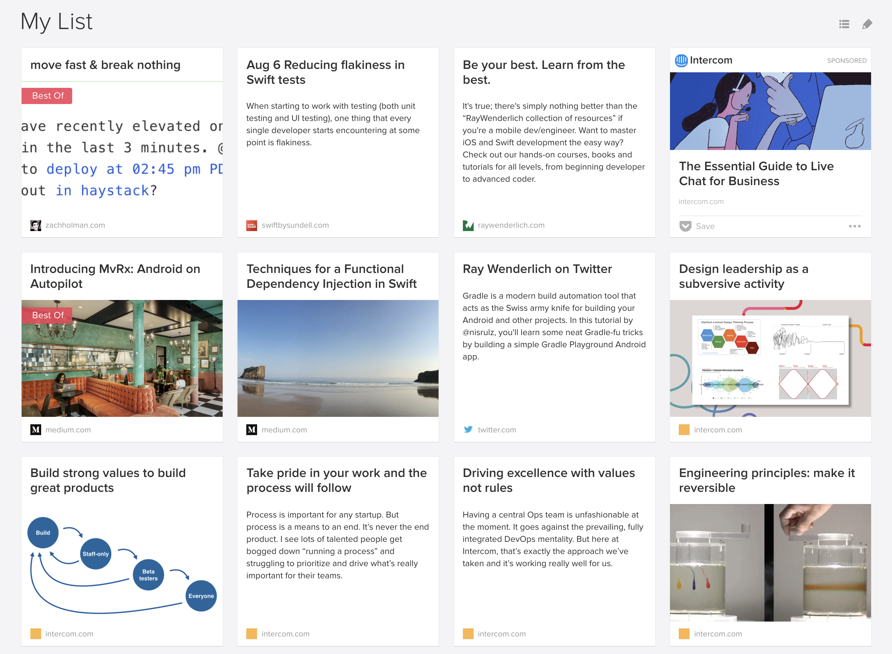
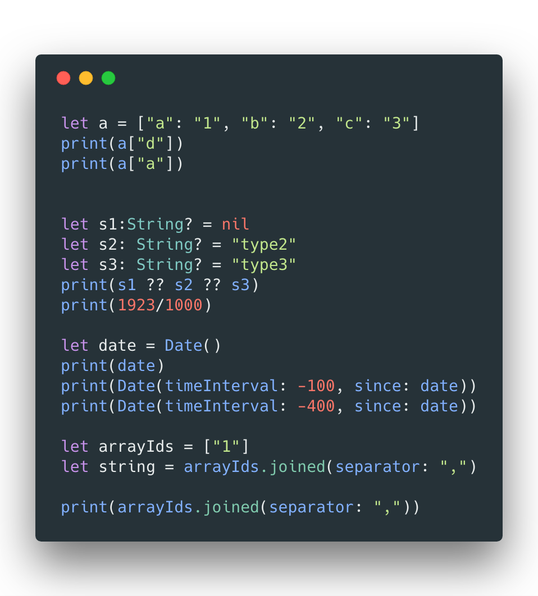
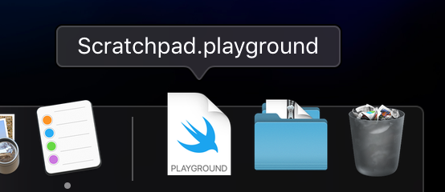

# Tools Tips and Resources
I'm always in search of handy tools, tips, and resources to make my life easier or to learn something new; anything from note taking apps, tools to help build my next app, or blogs to read to stay in the know. Here is a culmination of the things I use.

* [Tools](#tools)
  * Carbon
  * Adobe Color Wheel
  * APPLAUNCHPAD
  * oh-my-zsh 
  * Pocket
* [Tips](#tips)
  * XCode Playground Scratchpad
  * Version Managers
  * Slack Themes
* [Resources](#resouces)
  * Swift by Sundell
  * Ray Wenderlich

# Tools
## [Carbon](https://carbon.now.sh)
Share images of your source code. Wide selection of color themes and languages to choose from.

## [Adobe Color Wheel](https://color.adobe.com/create/color-wheel/)
Choose between different color harmonies to find colors that go well together.

## [APPLAUNCHPAD](https://theapplaunchpad.com/)
Tool to place your app screenshots into mockups.

## [oh-my-zsh](https://ohmyz.sh/)
A framework to manage zsh configurations, but let's be real, we all probably only use this for the terminal themes 

## [Pocket](https://getpocket.com/)
Save articles, videos, and stories from any web page. I primarily use it to save articles to read. 

# Tips
## XCode Playground Scratchpad
Add a Playground to your dock to easily access to test concepts. Here's a snippet of some things I have in my scratchpad (don't ask why I have them)

## Version Managers
**ALWAYS USE THEM!!!** I have nvm and rvm setup for my local development. When apps and repos have different requirements to build, using a version manager is a lifesaver.
## [Slack Themes](https://slackthemes.net)
Are you not creative enough to make your own Slack theme? Are there too many color choices for you to actually pick and make your own color theme? [slackthemes.net](https://slackthemes.net) have pre-made themes and you just need to copy the color codes into your Slack preferences.

# Resources
## [Swift by Sundell](https://www.swiftbysundell.com/)
A weekly blog about swift development by John Sundell. They're short and easily digestable blogs. Just enough explanation to understand, as well as examples and code snippets to go along with it. 
## [Ray Wenderlich](https://www.raywenderlich.com/)
If you learn best by doing, this is the site for you. They have a lot of step-by-step tutorials that cover a lot of the core topics. It's everything you'd ever need to get your foot in the door to build and ship your first app. 