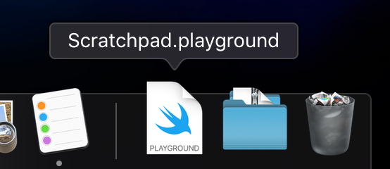

# Tips

## XCode Playground Scratchpad

Add a Playground to your dock to easily access to test concepts. Here's a snippet of some things I have in my scratchpad (don't ask why I have them).

\

## Version Managers

**ALWAYS USE THEM!!!** I have nvm and rvm setup for my local development. When apps and repos have different requirements to build, using a version manager is a lifesaver.

## [Slack Themes](https://slackthemes.net)

Are you not creative enough to make your own Slack theme? Are there too many color choices for you to actually pick and make your own color theme? [slackthemes.net](https://slackthemes.net) have pre-made themes and you just need to copy the color codes into your Slack preferences.
