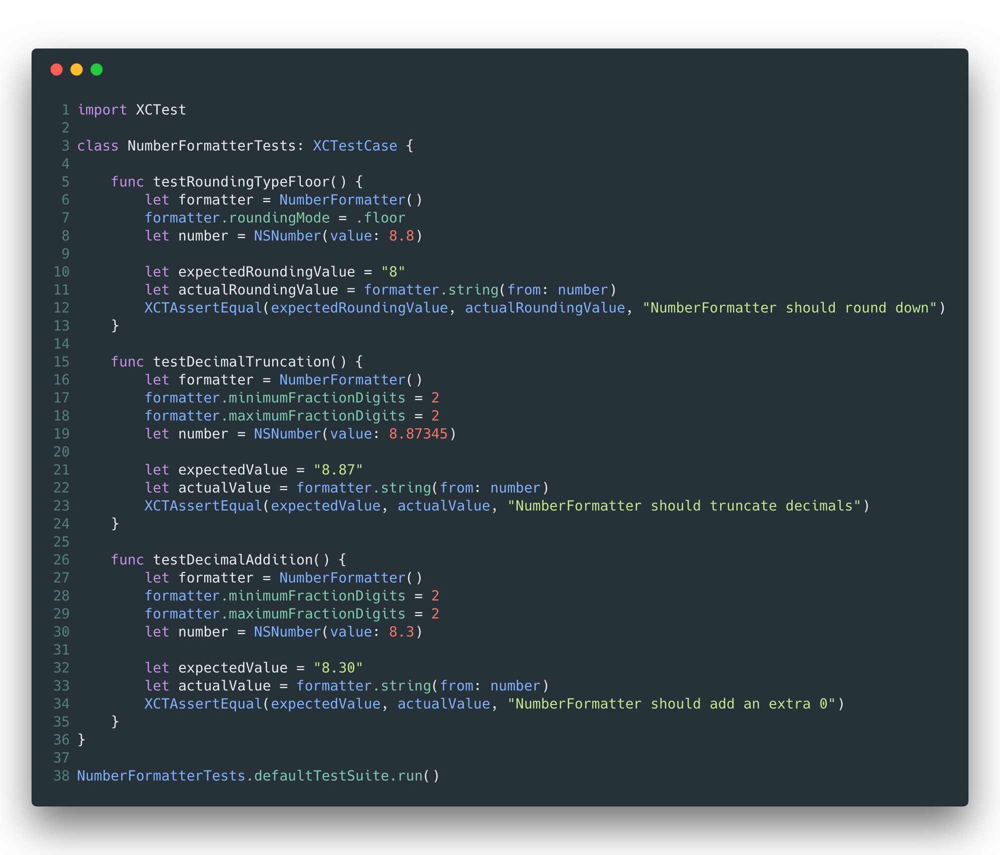
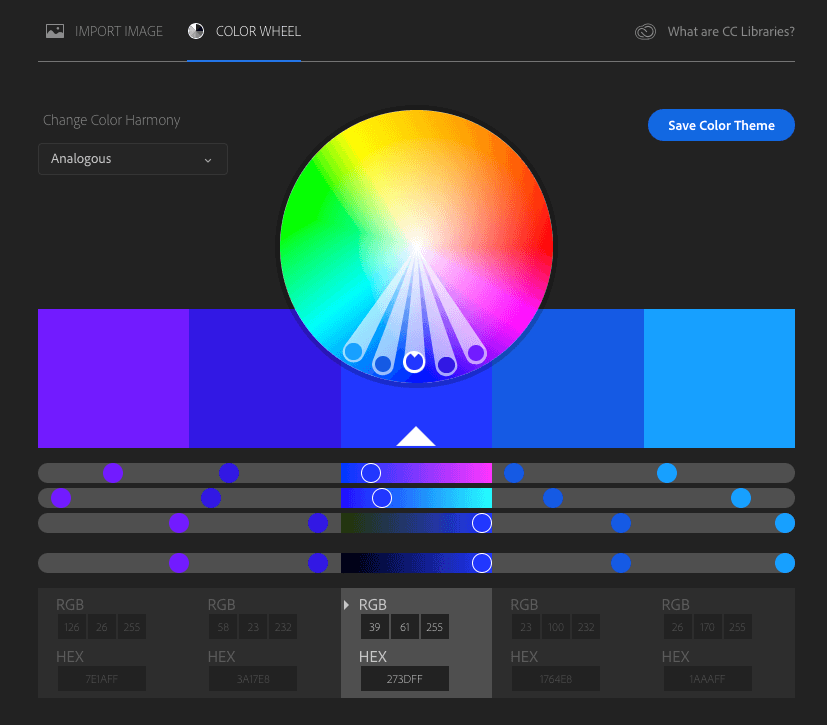

# Tools
## [Carbon](https://carbon.now.sh)
Share images of your source code. Wide selection of color themes and languages to choose from.

## [Adobe Color Wheel](https://color.adobe.com/create/color-wheel/)
Choose between different color harmonies to find colors that go well together.

## [oh-my-zsh](https://ohmyz.sh/)
A framework to manage zsh configurations, but let's be real, we all probably only use this for the terminal themes.

## [Pocket](https://getpocket.com/)
Save articles, videos, and stories from any web page. I primarily use it to save articles to read. 

## BetterSnapTool/Magnet
MacOS apps that allows you to snap windows to areas of the screen (left half, left two-thirds, right half, top half, etc), and both support keyboard shortcuts.

[BetterSnapTool](https://itunes.apple.com/us/app/bettersnaptool/id417375580?mt=12)

[Magnet](https://itunes.apple.com/us/app/magnet/id441258766?mt=12)

## [OmniDiskSweeper](https://www.omnigroup.com/more)
If you're running out of disk space on your computer, this will sweep your computer to show you the directories that have the most memory usage. I use this quite often to clean up a lot of Xcode directories.

## [MarvelApp](https://marvelapp.com/)
I use this to mockup the apps I build in my spare time. It has a free option, but it limits you to only two projects

## [Expo](https://expo.io/)
A tool for React Native projects. Expo makes it super easy to start, build, and develop a React Native project. You can also post your projects on their website, and although I haven't published a RN app yet, they also have instructions to push to both the Play Store and the App Store

## VSCode Extensions
Even though I'm primarily a native mobile developer, I occassionally do React Native or React development, or just need to use it for other things. Here are a few extensions I use:
* [GitLens](https://marketplace.visualstudio.com/items?itemName=eamodio.gitlens)
* [Bracket Pair Colorizer](https://marketplace.visualstudio.com/items?itemName=CoenraadS.bracket-pair-colorizer-2)
* [TSLint](https://marketplace.visualstudio.com/items?itemName=eg2.tslint)
* [Material Icon Theme](https://marketplace.visualstudio.com/items?itemName=PKief.material-icon-theme)
* [Material Theme](https://marketplace.visualstudio.com/items?itemName=Equinusocio.vsc-material-theme)

## Chrome Extensions
Extensions I have installed
* [JSONView](https://chrome.google.com/webstore/detail/jsonview/chklaanhfefbnpoihckbnefhakgolnmc)
* [ChromeiQL](https://chrome.google.com/webstore/detail/chromeiql/fkkiamalmpiidkljmicmjfbieiclmeij)
* [New Tab Draft](https://chrome.google.com/webstore/detail/new-tab-draft/nmfjkeiebceinkbggliapgfdjphocpdh)
